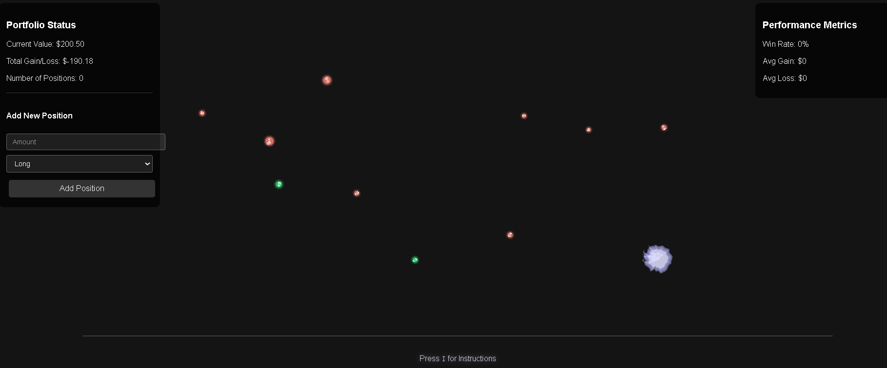

# Amoeba Portfolio 3D Simulator

A collection of p5.js and Three.js HTML scripts to visualize a portfolio as a 3D organism

*Built with Cursor*

**Clarification: Amoeba is the name for the project, I realize that Amoeba actually use pseudopodia and not the tentacles that are used to simulate the market "feelers" in this simulation. Version 3 attemps to enhance this realism.**  

There are three versions of the simulation:  

[Version 1](https://cheddarbutler.com/work/amoebaportfolio/)

[Version 2:](https://cheddarbutler.com/work/amoebaportfolio/amoebaportfoliov2.html)

[Version 3:](https://cheddarbutler.com/work/amoebaportfolio/amoebaportfoliov3.html)

