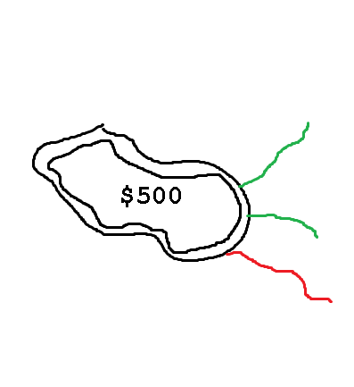

# Amoeba Portfolio 3D Simulator

A collection of p5.js and Three.js HTML scripts to visualize a portfolio as a 3D organism

*Built with Cursor*

**Clarification: Amoeba is the name for the project, I realize that Amoeba actually use pseudopodia and not the tentacles that are used to simulate the market "feelers" in this simulation.**  

There are three versions of the simulation

